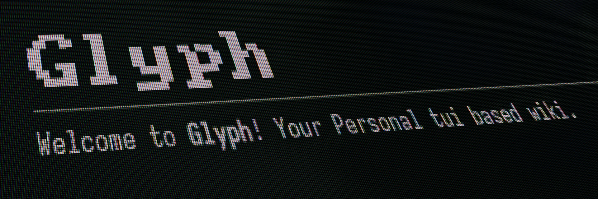

Powered by Ratatui

### Markdown Support
- [x] Heading
- [x] List 
- [x] Bold/Italic/Underline
- [x] Horizontal Line
- [ ] Image
- [ ] Table

### Storage
Currently using Rusqlite.

### Built-in Editor
The built-in editor is highly similar to vim, but with very limited features.

### Guide
`glyph`: Directly Open the tui application itself.

`glyph create <glyph-name>`: Create a new Glyph without opening the application.

`glyph open <glyph-name>`: Open a Glyph in application.

`glyph delete <glyph-name>`: Delete a Glyph without opening the application.
